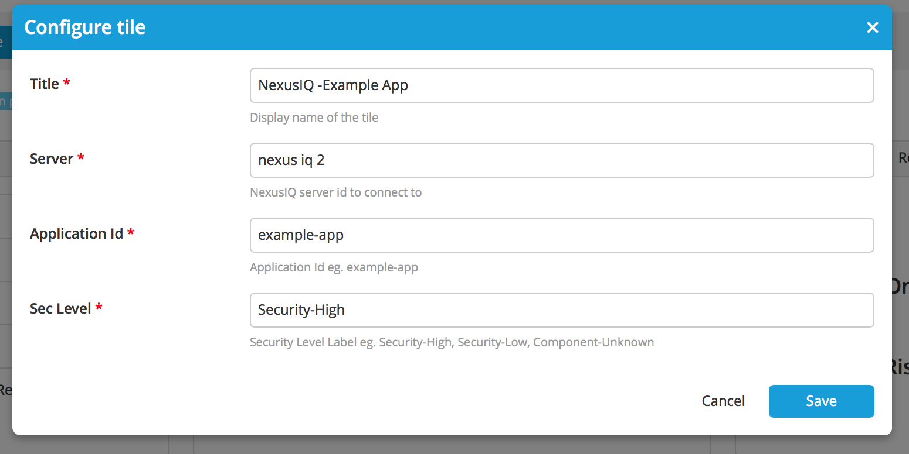

# Preface #

This document describes the functionality provided by the xlr-sonatype-nexus-iq-plugin-plugin.

See the **[XL Release Documentation](https://docs.xebialabs.com/xl-release/index.html)** for background information on XL Release and release concepts.

# CI status #

[![Build Status][xlr-sonatype-nexus-iq-plugin-travis-image] ][xlr-sonatype-nexus-iq-plugin-travis-url]
[![Build Status][xlr-sonatype-nexus-iq-plugin-codacy-image] ][xlr-sonatype-nexus-iq-plugin-codacy-url]
[![License: MIT][xlr-sonatype-nexus-iq-plugin-license-image] ][xlr-sonatype-nexus-iq-plugin-license-url]
[![Github All Releases][xlr-sonatype-nexus-iq-plugin-downloads-image] ]()

[xlr-sonatype-nexus-iq-plugin-travis-image]: https://travis-ci.org/xebialabs-community/xlr-sonatype-nexus-iq-plugin.svg?branch=master
[xlr-sonatype-nexus-iq-plugin-travis-url]: https://travis-ci.org/xebialabs-community/xlr-sonatype-nexus-iq-plugin
[xlr-sonatype-nexus-iq-plugin-codacy-image]: https://api.codacy.com/project/badge/Grade/b78313b1eb1b4b058dc4512b4d48c26f
[xlr-sonatype-nexus-iq-plugin-codacy-url]: https://www.codacy.com/app/rvanstone/xlr-sonatype-nexus-iq-plugin
[xlr-sonatype-nexus-iq-plugin-license-image]: https://img.shields.io/badge/License-MIT-yellow.svg
[xlr-sonatype-nexus-iq-plugin-license-url]: https://opensource.org/licenses/MIT
[xlr-sonatype-nexus-iq-plugin-downloads-image]: https://img.shields.io/github/downloads/xebialabs-community/xlr-sonatype-nexus-iq-plugin/total.svg

# Overview #

The xlr-sonatype-nexus-iq-plugin is a XL Release plugin that enables the evaluation of a binary within Nexus IQ

## Dependencies ##
You need to install the [NexusIQ command line interface (CLI)](https://books.sonatype.com/sonatype-clm-book/html/book/cli.html) local to your XL Release Server

## Installation ##

Place the latest released version under the `plugins` dir.

This plugin (1.0.0+) requires XLR 6.1x+

## Extras ##
Here's a link to the nexus CLI jar file to download : [https://download.sonatype.com/clm/scanner/nexus-iq-cli-1.42.0-01.jar](https://download.sonatype.com/clm/scanner/nexus-iq-cli-1.42.0-01.jar)

## Configuration ##

## Types ##

+ Evaluate Binary

   - binaryUrl - Location of the binary to be evaluated (Could be local to XLR or a URL (e.g. Jenkins workspace)
   - nexusiqApp - Application Id ( Public ID) in Nexus IQ
   - nexusiqStage - Stage of release [develop|build|stage-release|release|operate]

+ Task Details

  

+ Running Release

  
   
## Tiles ##

+ Tile configuration

  

+ Summary Report of Evaluations
  
  
